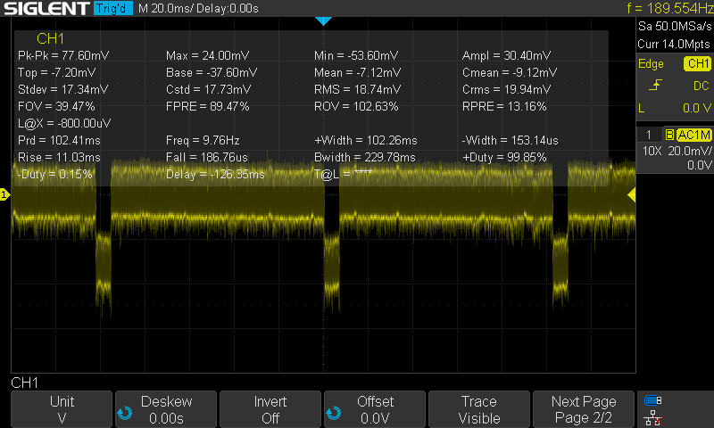
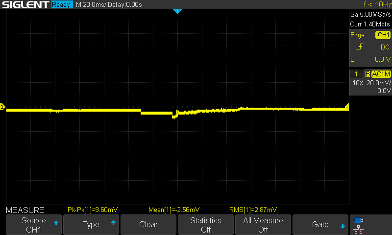
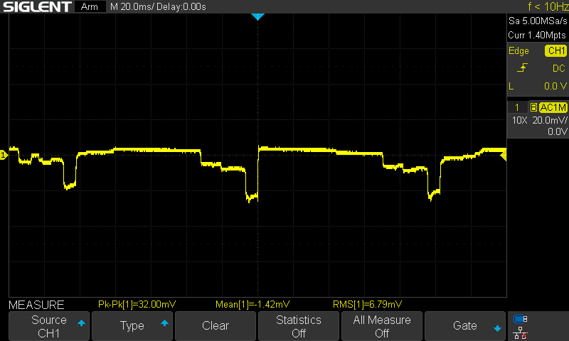
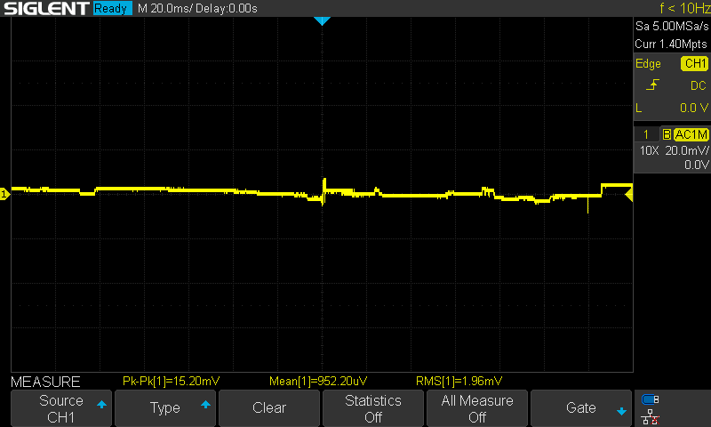
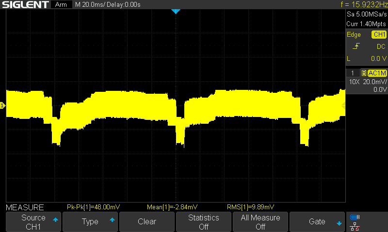
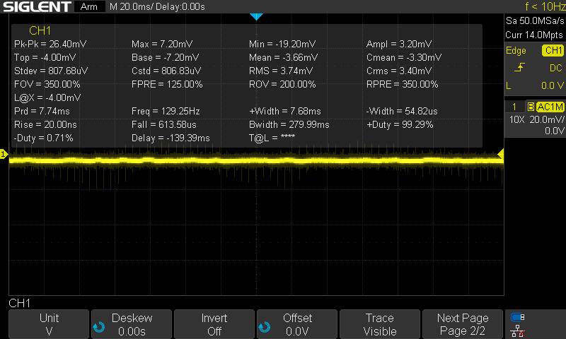
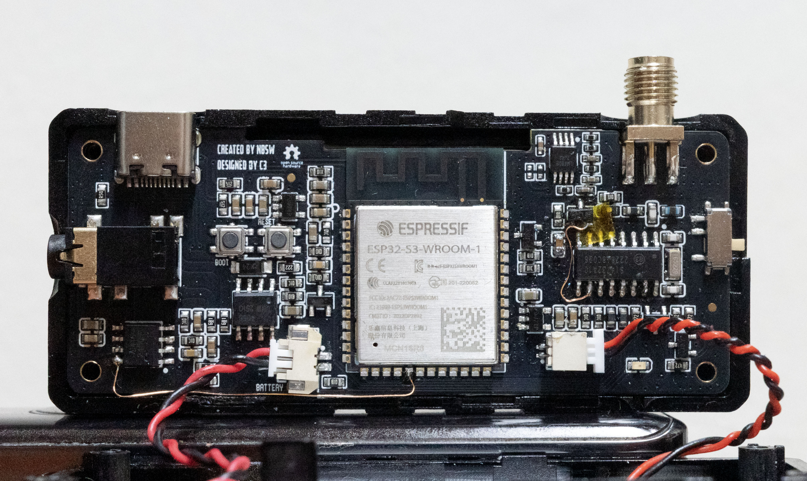

# 📻 Amnvolt V3S JFET Power Supply Noise Investigation and Mod

This document summarizes the investigation of the **AMNVOLT MiniATS V3S** power supply for the JFET (K51G) High-Z stage, comparing the original rail of the PCB with a new feed from the **SI4732 Pin 10**.

Mod from **[Peter Neufeld’s modifications](https://peterneufeld.wordpress.com/2025/06/13/si4732a-minirx-modifications/)**.

---

## 🔧 Mod Overview

- Original design powered the **JFET** from a noisy rail influenced by the OLED backlight PWM.  
- Initial trials included a **22 Ω series resistor** and **local decoupling (100 nF + 10 µF)**.  
- Final configuration shown here uses **direct feed only (no resistor, no capacitors, as Peter suggests)**.  
- Comparisons were made with the **Screen ON** and **Screen OFF**.

---

## 📐 DC Bias

- **SI4732 Pin 10:** 3.3207 V  
- With 22Ω in series (initial test): **3.2194 V** at JFET side → ~101 mV drop (≈4.6 mA current).  

*(The series resistor was later removed for final tests.)*

---

## 📊 Time-Domain Noise (Oscilloscope)

**Settings:** AC coupling, BW limit 20 MHz, probe ×10.

### Old Line (original rail)
- RMS ≈ **18–20 mV**  
- Pk–Pk ≈ **70–80 mV**  
- Strong periodic disturbances (PWM-related).  

---

### New Line (SI4732 pin 10)
- RMS ≈ **3–4 mV**  
- Pk–Pk ≈ **16–30 mV**  
- Much quieter baseline.  

---

### Screen OFF
- Noise reduces further with backlight off.  
- Confirms display PWM as an additional noise source.  

  

---

## 📉 FFT Analysis

**Settings:** FFT, Hanning window, span ≈ 0–200 kHz.  

### Old Line
- Clear tones around **10–20 kHz** and harmonics.  
- Higher noise floor.  

---

### New Line (SI4732 pin 10)
- Noise floor reduced by ~10–15 dB.  
- PWM peaks suppressed; screen OFF → nearly flat spectrum.  

  

---

## 🗂 Archived (Previous) Measurements (with R/C filter)

Earlier experiments included a **22Ω series resistor** and **local decoupling (100nF + 10µF) to conist a R/C filter**.  
Older results are archived for reference in [`../JFET_Power_Supply_Mod_Old/`](../JFET_Power_Supply_Mod_Old/).

Example:  

---

### 📋 Comparative Results

| Case                     | RMS Noise (mV) | Peak-to-Peak (mV) | Notes                          |
|---------------------------|----------------|-------------------|--------------------------------|
| Old rail, Screen ON       | 18–20          | 70–80             | Strong PWM artifacts visible   |
| New rail (Pin10), Screen ON | 3–4            | 16–30             | Much quieter baseline          |
| Old rail, Screen OFF      | ~15–16         | ~60–70            | PWM source removed             |
| New rail (Pin10), Screen OFF | ~2–3          | 12–20             | Flattest trace, lowest noise   |

---

### 📈 FFT Comparison (0–200 kHz, Hanning)

| Case                           | 20 kHz peak (dBV) | 40 kHz (2nd) (dBV) | Noise floor @ 50–100 kHz (dBV) | Notes |
|--------------------------------|-------------------:|-------------------:|-------------------------------:|------|
| Old rail, Screen ON            | ≈ –80 to –85      | ≈ –88 to –95       | ≈ –105 to –110                 | PWM fundamentals + richer harmonics |
| New rail (Pin10), Screen ON    | ≈ –90 to –100     | ≈ –100 to –110     | ≈ –110 to –120                 | Lower peaks; smoother LF spectrum   |
| Old rail, Screen OFF           | ≈ –95 to –100     | ≈ –105 to –112     | ≈ –108 to –115                 | PWM source removed; residual LF only |
| New rail (Pin10), Screen OFF   | ≈ –100 to –110    | ≈ –110 to –120     | ≈ –115 to –125                 | Flattest spectrum; lowest floor     |

---

## ✅ Conclusion

- Powering the JFET from **SI4732 pin 10** significantly lowers supply noise at the High-Z input stage:  
  - **Old rail:** ~18–20 mV RMS  
  - **New rail (direct):** ~3–4 mV RMS  
- FFT confirms suppression of PWM harmonics from the OLED display.  
- Even without RC filtering, SI4732 pin 10 provides a **much cleaner supply**.
- Next step is to **reinstall RC filter** (22Ω registor and decoupling capacitors 100nF & 10μF).  
  
---

## 🔍 PCB View of the Mod

The following picture shows the **Amnvolt V3S PCB** with the applied modification.  
The JFET (K51G) no longer takes power from the original noisy rail (it's lifted up), but is instead connected directly to **SI4732 Pin 10** .  
This ensures the Hi-Z input stage receives a cleaner supply.

*(The wire connecting ESP32 GPIO11 to pin10 (VOP) of NS4160 (speaker amplifier) is for future use of the hjberndt.de RTTY/CW decoding [firmware](http://www.hjberndt.de/dvb/pocketSI4735DualCoreDecoder.html))*

---

📂 All oscilloscope screenshots are in `./images` (final setup).  
Archived R/C filter tests are in `../JFET_Power_Supply_Mod_Old/`.
