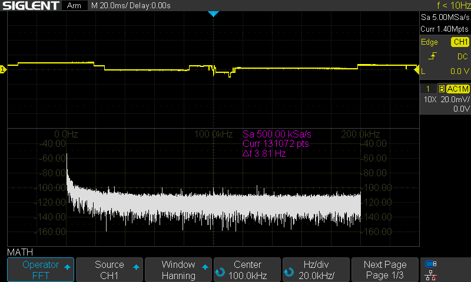
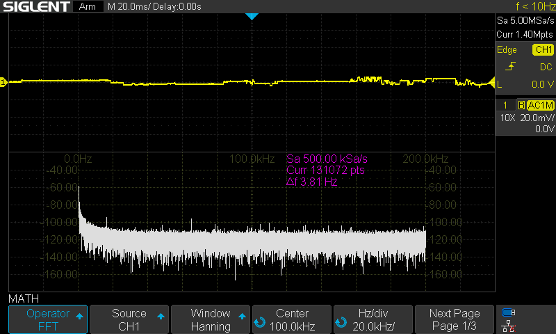
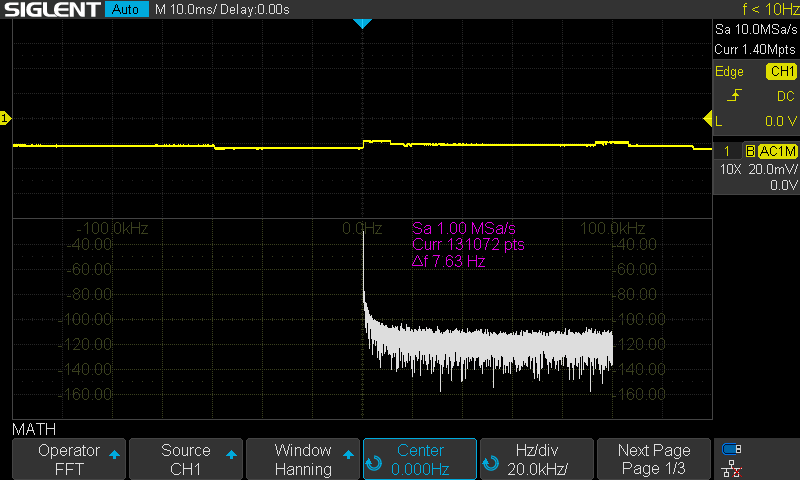

# JFET Supply Modification and Noise Measurements

This modification is based on the excellent work by **Peter Neufeld (DB9JG)**.  
See his detailed write-up here: [Si4732A MiniRX Modifications](https://peterneufeld.wordpress.com/2025/06/13/si4732a-minirx-modifications/).

---

## 🔧 The Mod

The goal is to improve the supply quality for the JFET (K51G), which originally was fed from a noisy rail.  
The modification consists of:

- Cutting the old supply line.
- Feeding the JFET from the **SI4732 VDD_RF (pin10)** through a **22Ω resistor**.  
- Adding **decoupling capacitors** close to the JFET:
  - 100 nF ceramic  
  - 10 µF ceramic  

This provides the JFET with a cleaner supply, leveraging the already well-decoupled SI4732 rail.

---

## 📏 Voltage Measurements

Initial DC measurements showed the expected drop across the series resistor:

- **SI4732 pin 10**: 3.3207V  
- **JFET (after 22Ω resistor)**: 3.2194V  

The ~100 mV drop confirms current flow through the resistor and defines the bias for the JFET.

---

## 📉 Oscilloscope Measurements

All measurements taken with:

- **Siglent SDS1202X-E oscilloscope**
- AC coupling, ×10 probe
- Bandwidth limit: 20 MHz
- Horizontal scale: 20 ms/div  
- Vertical scale: 20 mV/div  

---

### Old Feed (before the mod)

  

- Supply from the original rail.  
- Strong PWM ripple visible, peak-to-peak ~78 mV, RMS ~18 mV.

---

### SI4732 Pin 10

  

- Direct measurement on VDD_RF.  
- Much quieter line: p-p ~26 mV, RMS ~3.7 mV.

---

### JFET (with 22Ω)

  

  

- Ripple reduced compared to old feed.  
- RMS ~3.8 mV, peak-to-peak ~26–30 mV.  
- Clean trace, minimal coupling of the backlight PWM.

---

### JFET (bypassing the 22Ω)

  

- Similar RMS noise (~3.9–4.0 mV).  
- Slightly larger peaks than with resistor.  
- The 22 Ω helps isolate local decoupling and smooth out spikes.

---

## 📊 Comparison Table

| Measurement Point          | Peak-to-Peak | RMS Noise | Notes                                   |
|----------------------------|--------------|-----------|-----------------------------------------|
| Original JFET Supply       | ~78 mV       | ~18 mV    | Strong PWM ripple                       |
| SI4732 Pin 10              | ~26 mV       | ~3.7 mV   | Very clean, well-decoupled               |
| JFET w/ 22Ω                | ~26–30 mV    | ~3.8 mV   | Clean, resistor helps decoupling         |
| JFET w/o 22Ω               | ~25–30 mV    | ~3.9–4.0 mV| Still clean, slightly more spiky ripple |

---

## ✅ Conclusion

Feeding the JFET from the **SI4732 pin 10** provides a much cleaner supply compared to the original rail.  
Adding a **22Ω resistor with local decoupling capacitors (100nF + 10µF)** offers the best compromise:  
- Lower RMS noise (~3.8 mV vs ~18 mV original).  
- Reduced ripple coupling from the display PWM.  

This ensures the JFET preamp delivers a cleaner RF signal to the SI4732, improving overall reception quality.
