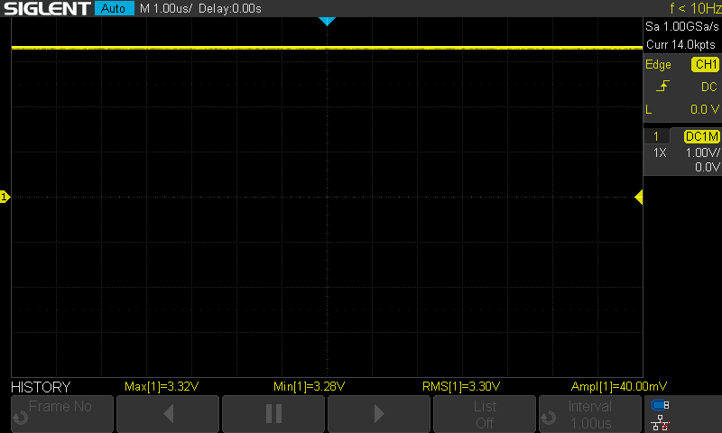
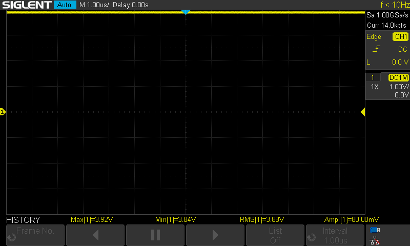
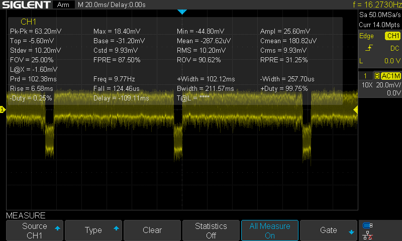
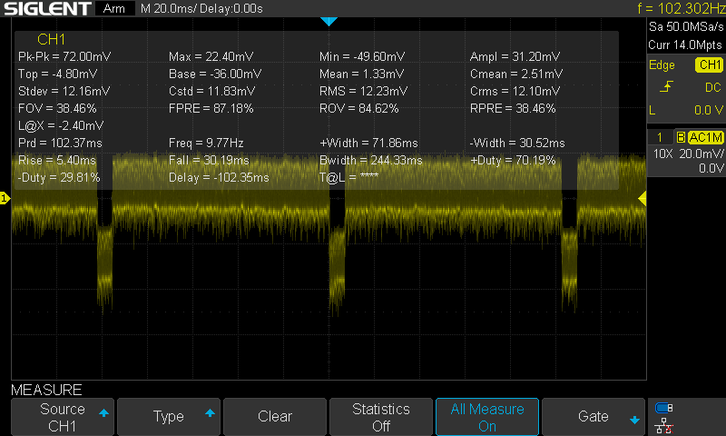
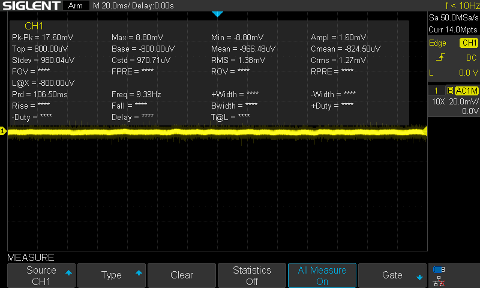

# Noise & Supply Measurements – AMNVOLT MiniATS V3S

Supply voltages and noise behavior of the AMNVOLT MiniATS V3S were checked, focusing on the **JFET input stage (High-Z circuit)**.

Two alternative supply sources were tested:  
- From the **SI4732 VDD_RF (pin10)**  
- From the **main power switch output**  

The JFET under test is marked **K31G** in SOT-23 package.  

👉 Measurements were taken at the **Drain pin (pin 2)**.

  
---

## ⚙️ Oscilloscope Settings

- **Probe**: ×10, ground spring lead
- **Coupling**:  
  - DC (for bias voltage)
  - AC (for ripple/noise)
- **Bandwidth Limit**: 20 MHz ON
- **Vertical Scale**:
  - DC: 1 V/div
  - AC: 10–20 mV/div
- **Timebase**:
  - Fast noise/spikes: 1–10 µs/div
  - Slow ripple/PWM: 1–10 ms/div
- **Measurements enabled**: Vpp, RMS, Frequency
- **Persistence**: ~1 s (to catch sporadic spikes)

---

## 🔋 Initial DC Measurements

| Test Point             | Voltage Range | Mean Voltage | Notes |
|-------------------------|---------------|--------------|-------|
| **VBAT (battery rail)** | 3.84 – 3.92 V | ~3.87 V | Battery rail, small variation (≈80 mV window). |
| **JFET Drain (pin 2)** | ~3.28 – 3.32 V | ~3.30 V | Stable bias at Drain of K31G JFET. |
| **SI4732 VDD_RF (pin10)** | 3.84 – 3.92 V | ~3.88 V | Close to battery rail. |
  
  
📷 Screenshots:  

**VBAT (battery rail)**  
  

**JFET Drain (pin 2)**  
  

**SI4732 VDD_RF (pin10)**  
  
  
  
---

## 📊 Ripple / Noise Measurements

| Test Point             | Pk–Pk Noise | RMS Noise | Dominant Frequency | Observations |
|-------------------------|-------------|-----------|--------------------|--------------|
| **JFET Drain (pin 2)** | ~17.6 mVpp  | ~1.4 mV   | ~9.3 Hz (PWM spur) | Cleanest line, minimal ripple, best candidate for Hi-Z stage supply. |
| **SI4732 VDD_RF (pin10)** | ~63 mVpp   | ~10 mV    | ~9.7 Hz (PWM), plus higher harmonics | Appears visually flat due to local decoupling, but periodic dips from display PWM raise overall noise. |
| **ON/OFF switch output** | ~72 mVpp   | ~12 mV    | ~9.8 Hz (PWM backlight) | Noisiest, shows direct impact of IPS backlight PWM and ESP32 activity. |
  
  
📷 Screenshots:  
  
**ON/OFF switch output**  
  

**JFET Drain (pin 2)**  
  

**SI4732 VDD_RF (pin10)**  

  
> ℹ️ Note: The screenshots may look counter-intuitive at first glance.  
> The **JFET Drain (pin 2)** shows a more visible ripple pattern (~72 mVpp), while the **SI4732 VDD_RF (pin10)** looks flatter due to stronger local decoupling.  
> Numerically, however, the SI pin10 rail has significantly lower ripple (~17 mVpp).  
> This is why the trace of the SI supply appears “quiet” on the scope, while the JFET drain reveals more periodic ripple from the backlight PWM.
  
  
---

## ✅ Conclusion

- The **JFET Drain supply** is the cleanest option and the most suitable for powering the Hi-Z input stage.  
- The **SI4732 pin10** supply is acceptable but carries periodic PWM artifacts from the display.  
- The **ON/OFF switch output** is the noisiest and should be avoided for sensitive analog/RF stages.
