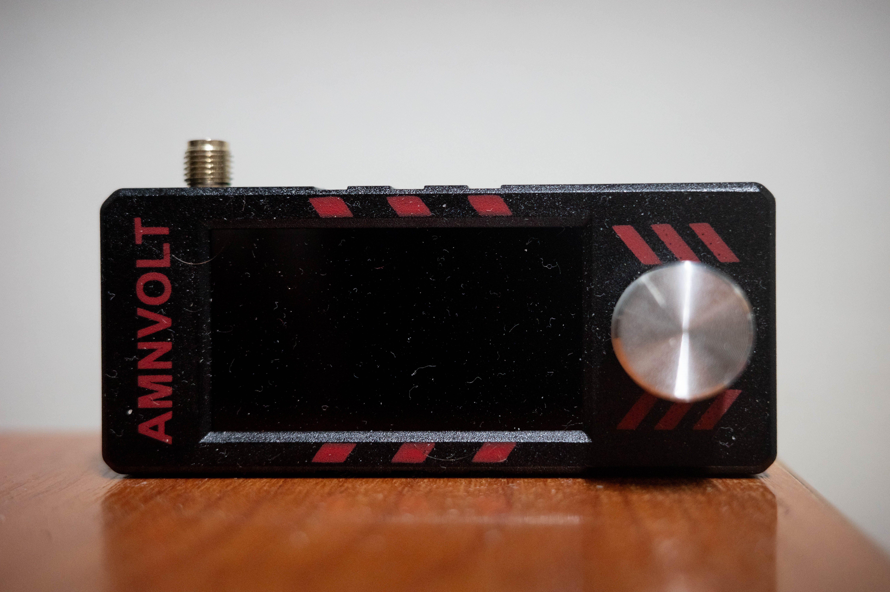
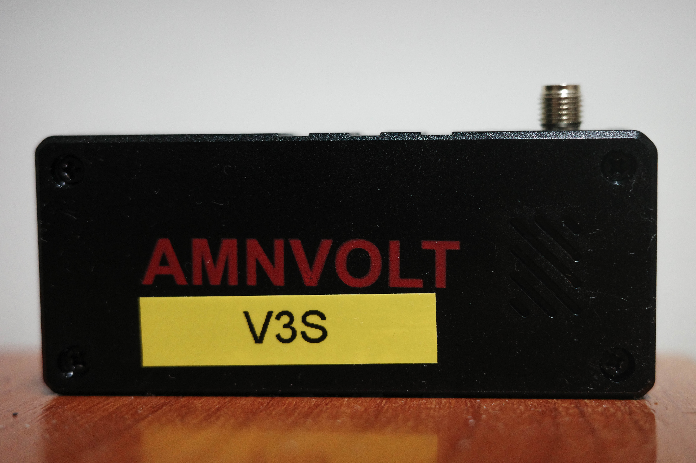
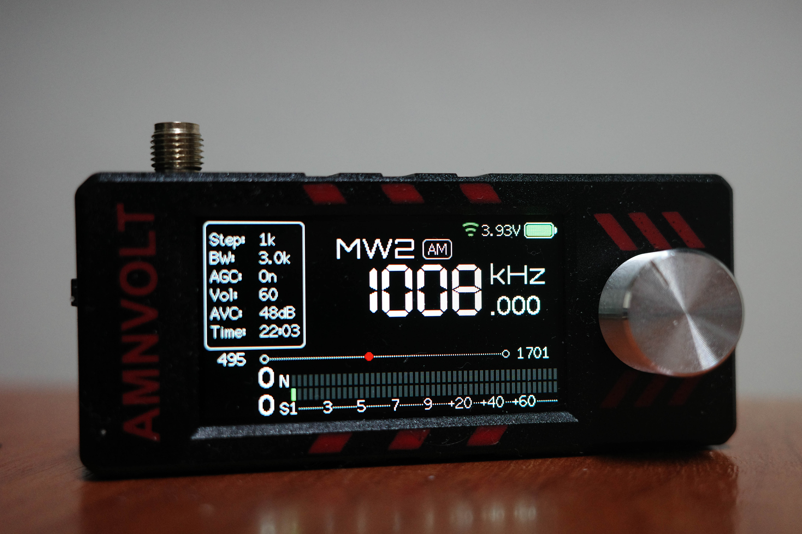
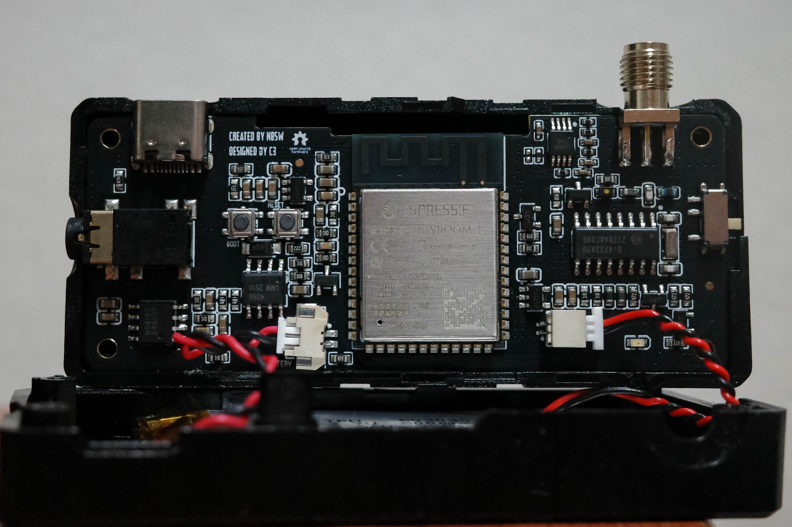
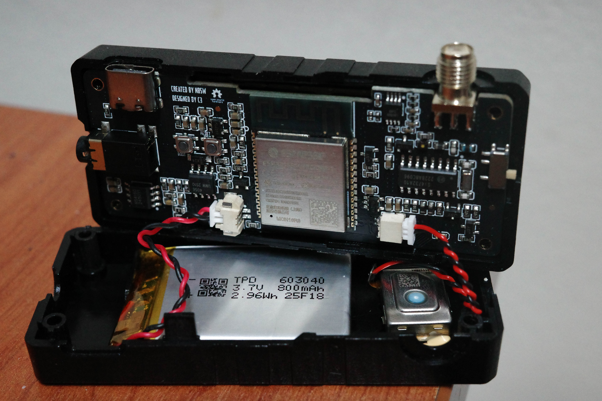
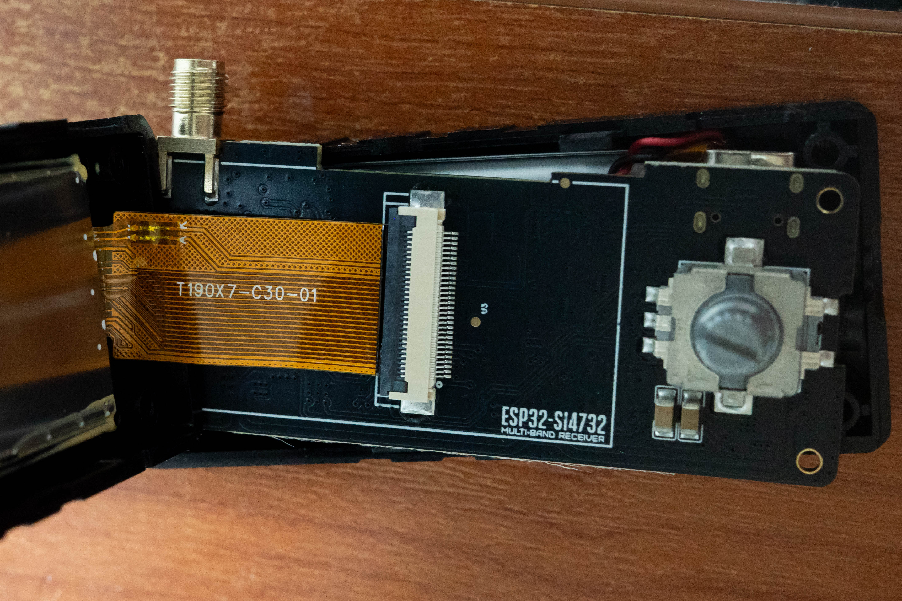
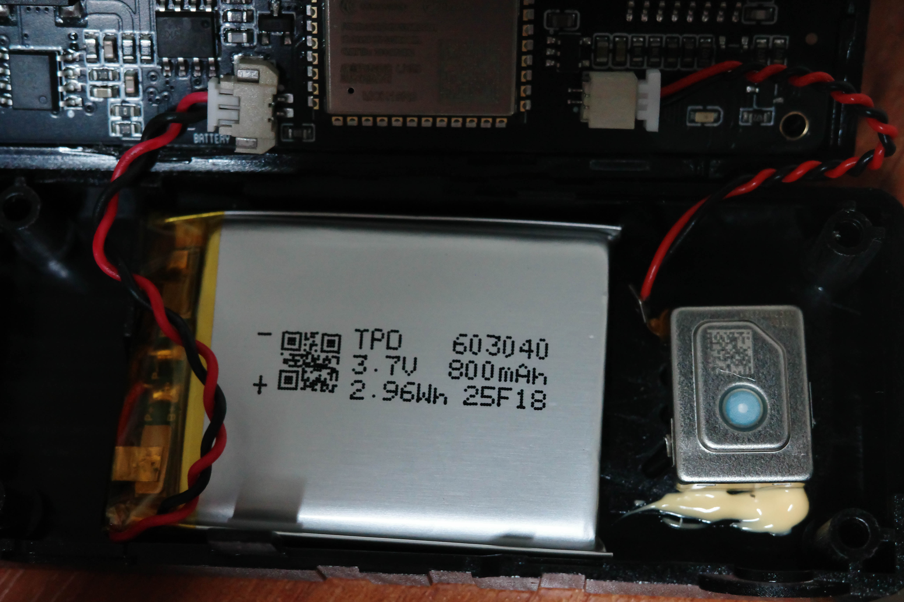

# MiniATS V3S (AMNVOLT) — ESP32 + SI4732 Multi‑Band Radio Receiver

Hands‑on photos, specs, and notes for the **MiniATS V3S** portable receiver.  
This page collects what’s observable from the unit in hand plus the manufacturer’s stated features.

> TL;DR: Latest (Jun‑2025) AMNVOLT Mini with **injection‑molded ABS shell**, **built‑in Hi‑Z** input network, **headphone amplifier**, and an optimized power circuit that **fixes the battery drain issue when powered-off**.

---

## 📸 Gallery

- **Front (powered off)**
  
  


- **Back**
  
  
  *(I put this sticker on to tell this radio apart from the others)*


- **MW/AM in operation**
  
  


- **FM in operation**
- 
  


- **Main PCB (top, close‑up)**
 
  


- **PCB with Li‑Po & speaker**

  


- **Front sub‑board with ESP32/SI4732 silkscreen**
  
  


- **Battery & speaker detail**  
  


---

## ⭐ Highlights
- **June 2025 / upgraded version.**
- **Built‑in Hi‑Z circuit** to improve weak‑signal handling on long‑wire/Hi‑Z antennas (The same with V3, a very simple High-Z circuit with a JFET).
- **Built‑in headphone amplifier** — noticeably louder in headphones than previous non‑amp versions (V1 actually, V2 and later has headphone amp).
- **Injection‑molded ABS enclosure** (stronger and cleaner than prior 3D‑printed shells). That's a really good upgrade.
- **JFET power circuit optimized** — no more “battery drain after shutdown” issue.
- **1.9‑inch IPS color display** (170×320) with adjustable backlight and on‑screen battery level.
- **800 mAh Li‑Po battery**; manufacturer quotes **10+ hours** typical listening.
- **Firmware upgradable** (ESP32 platform).

---

## 📡 Bands & Modes
- **Modes:** AM, **LSB**, **USB**, **FM (WFM)**  
- **Coverage:** LW/MW/SW (**150 kHz–30 MHz**) and **VHF FM 64–108 MHz**  

---

## 🛠️ Hardware (observed on this unit)
- **MCU/Module:** *ESP32‑WROOM‑32* (ESPRESSIF)  
  > Note: Some spec sheets/online sellers say “ESP‑32‑S3”, but the photos clearly show an ESP32‑WROOM‑32 module, at least on this unit.
- **RF IC:** Silicon Labs **SI4732** DSP receiver
- **Audio:** Integrated **headphone amplifier**; internal **speaker (≈1 W class)**  
- **Display:** **1.9″ IPS**, 170×320
- **Battery:** **Li‑Po 3.7 V 800 mAh** (cell marked **603040**, 2.96 Wh)
- **Connectors:** **SMA‑K (female, inner pin)** antenna, **3.5 mm stereo** headphone jack, **USB‑C** for charging/firmware
- **Enclosure:** **ABS injection‑molded**
- **On‑board:** JST battery connector, tactile buttons (BOOT/RESET), piezo/mini speaker

---

## 📦 File Layout
```
repo-root/
├─ README.md
└─ images/
   ├─ 1.jpg        # front
   ├─ 2.jpg        # back
   ├─ 3.jpg        # AM screen
   ├─ 4.jpg        # FM screen
   ├─ 5.jpg        # PCB close
   ├─ 6.jpg        # PCB + battery
   ├─ 7.jpg        # ESP32‑SI4732 sub‑board
   └─ 8.jpg        # battery & speaker detail
```

## ⚠️ Notes & Tips
- Use a **standard 5 V USB‑C charger** (no QC/PD fast‑charge).  
- As with any **Li‑Po** battery, avoid over‑discharge and store at moderate charge if unused for long periods. LiPo batteries (single cell) must be between 3.7V to 3.85V for storage.

---

## License
Unless stated otherwise, text and photos © the original author(s). If you reuse content, please provide attribution.
