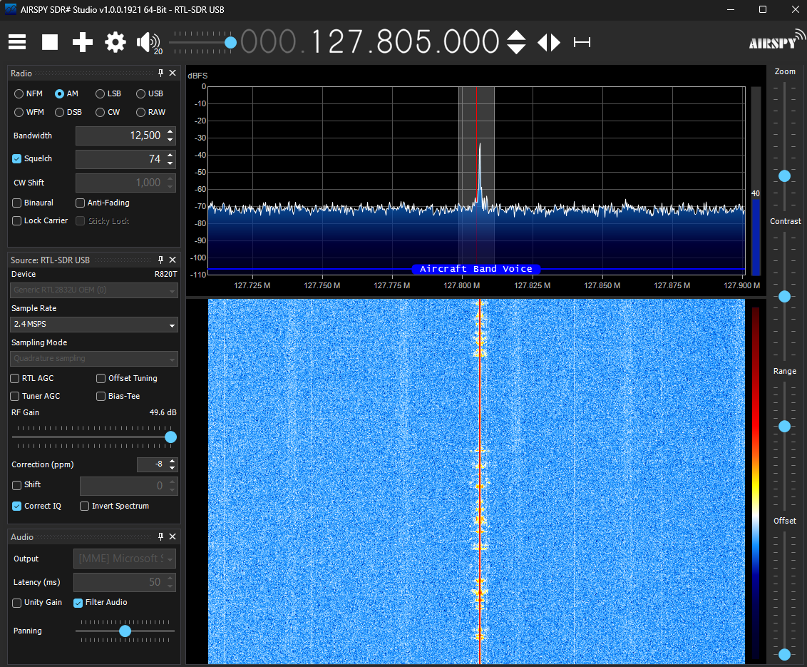
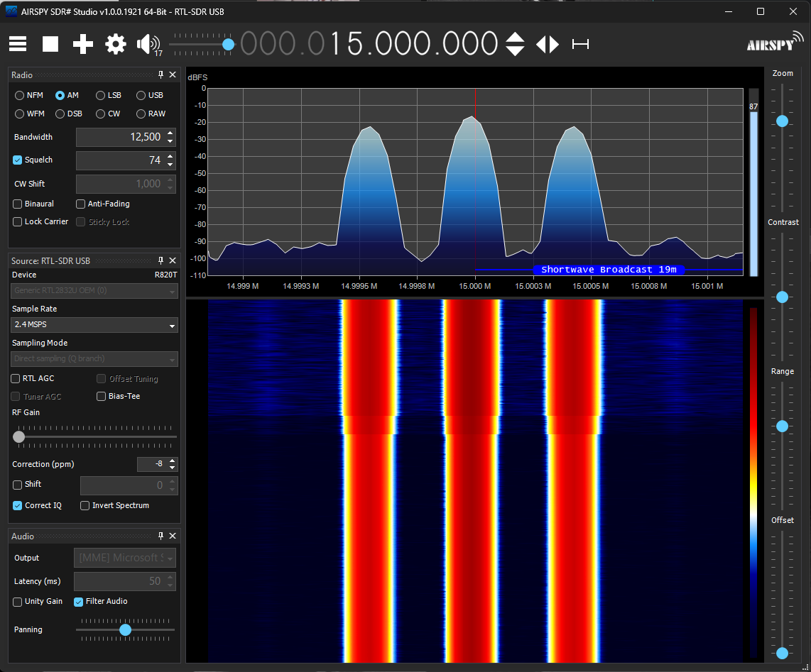
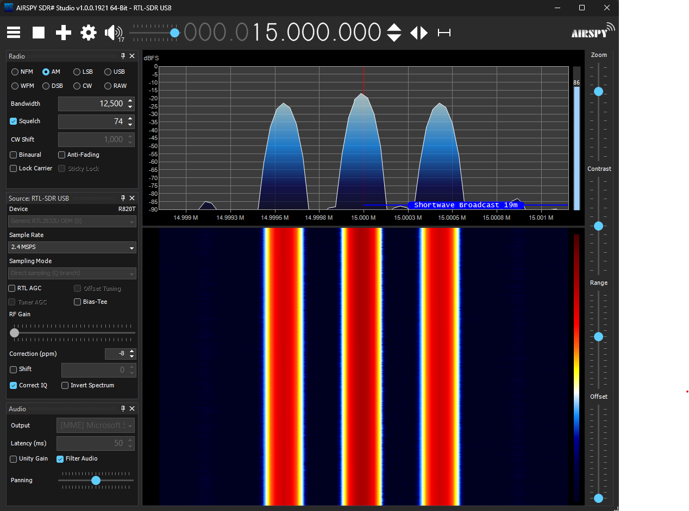
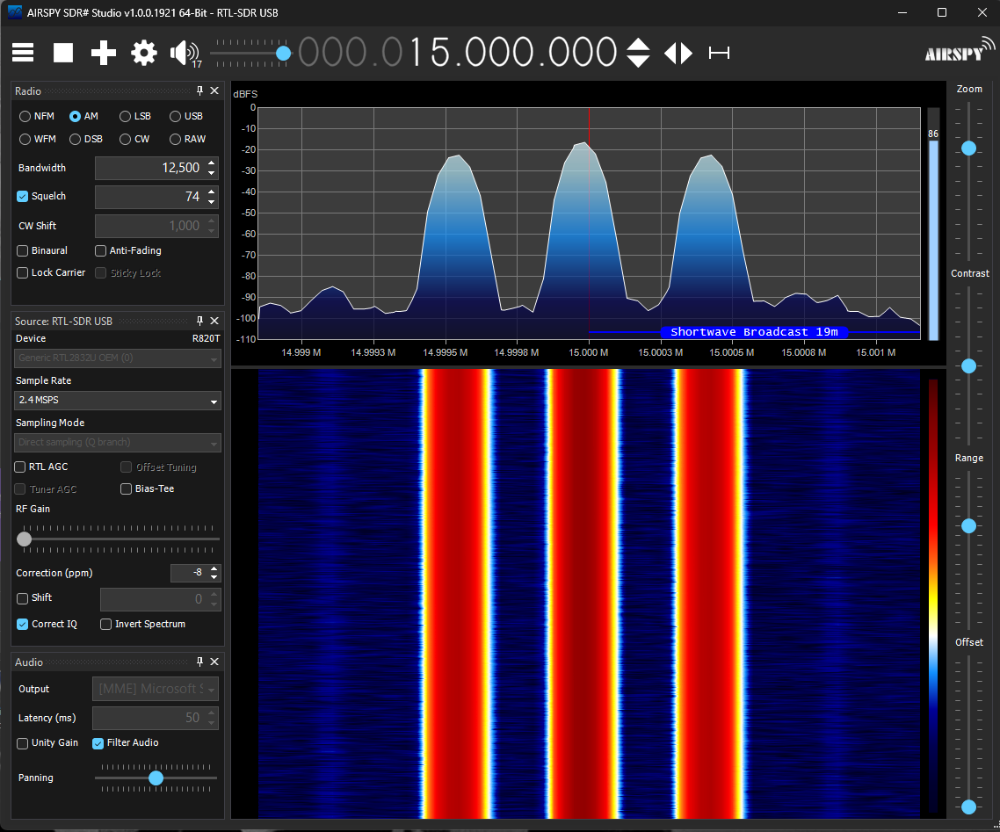
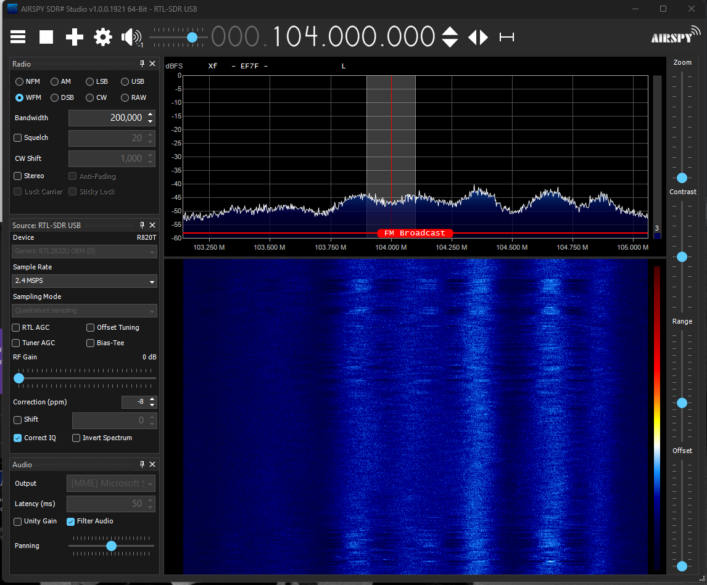
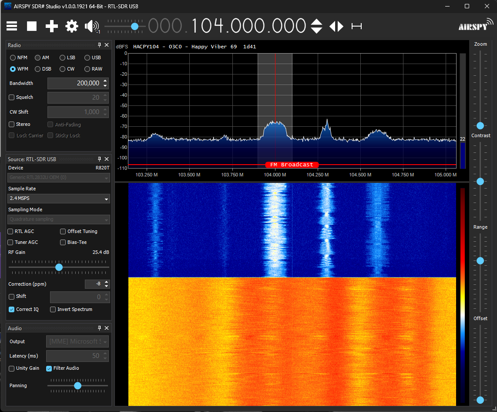
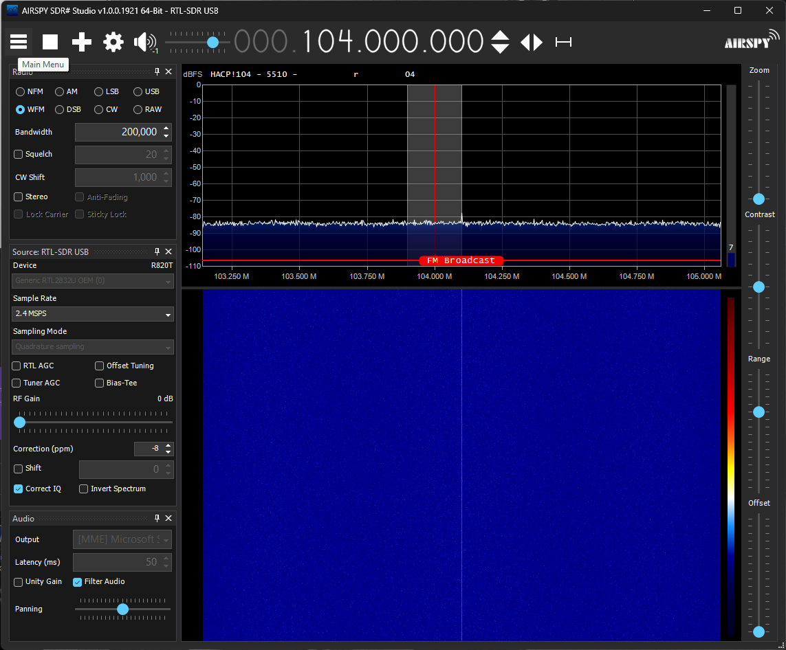
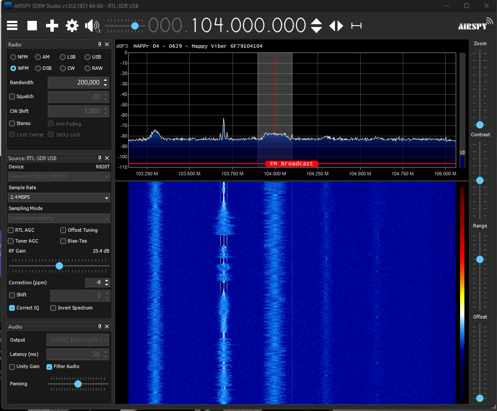
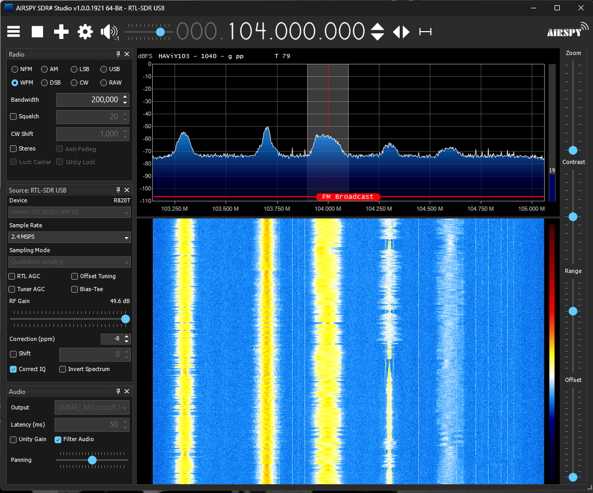

# 📡 FM Notch Filters Evaluation (NanoVNA + RTL-SDR)

## 🧪 Filters Tested

| Name | AliExpress Link | Notes |
|------|------------------|-------|
| **Good Filter** | [88–108MHz Bandstop Filter](https://vi.aliexpress.com/item/1005007873511665.html) | Sharp rejection, excellent performance |
| **Bad Filter** | [87.5–108MHz Notch Filter](https://vi.aliexpress.com/item/1005009129007135.html) | Marginal rejection, poor isolation |

---

## 🛰️ Airband & HF Observations

### ✈️ Aircraft Band Voice — 127.805 MHz (AM)

| Setup | Screenshot | Notes |
|-------|------------|-------|
| No Filter |  | Clean signal, but FM bleed is possible |
| Good Filter |  | Slightly better noise floor, less FM garbage |

---

### 📶 HF — 40m Ham Band @ 7.074 MHz (FT8/USB)

| Setup | Screenshot | Notes |
|-------|------------|-------|
| No Filter |  | Strong FT8 signals, FM overload potential |
| Good Filter |  | Better dynamic range, cleaner background |
| Bad Filter |  | |

> Direct sampling (Q-branch) on RTL-SDR v3

---

## 📻 FM Broadcast Band (104.0 MHz)

| Setup | Screenshot | Notes |
|-------|------------|-------|
| No Filter | | Loud local FM |
| Bad Filter |  | FM slightly attenuated, still audible @ 0dB Gain |
| Bad Filter |  | 25.4dB (Optimal setting) |
| Good Filter |  | No Gain |
| Good Filter |  | FM nearly gone, attenuated sharply (@ 25.4dB, as Bad Filter) |
| Good Filter | ) | @ Full Gain |

---

## 🔬 NanoVNA Measurements

Tested using NanoVNA Saver with calibrated patch cable. Only an SMA female-female adapter was inserted between calibration and filter.

### Good Filter (s1p/s2p: `GOODFILTER.*`)

| Frequency | Return Loss (S11) | Insertion Loss (S21) |
|-----------|-------------------|----------------------|
| 98.5 MHz | ~-10.6 dB | -52.6 dB |
| 100.95 MHz | ~-30.1 dB | -0.18 dB |
| 150.25 MHz | ~-13.4 dB | -0.66 dB |

🟢 Good notch at FM, minimal loss elsewhere  
📉 Min S21 Gain: **-58.4 dB** at 104.48 MHz

---

### Bad Filter (s1p/s2p: `BADFILTER.*`)

| Frequency | Return Loss (S11) | Insertion Loss (S21) |
|-----------|-------------------|----------------------|
| 98.5 MHz | ~-16.0 dB | -52.6 dB |
| 100.95 MHz | ~-25.9 dB | -0.075 dB |
| 150.25 MHz | ~-13.4 dB | -0.64 dB |

🟠 Shallower notch, wider curve  
📉 Min S21 Gain: **-54.4 dB** at 94.3 MHz

---

## 🧰 Test Equipment

- **Receiver**: RTL-SDR v3
- **Antenna**: Moonraker X1-HF (via 15–20m RG58)
- **Software**: SDR# Airspy Studio, NanoVNA Saver
- **Filter Chain**: SDR → SMA f-f → filter → 10cm SMA patch → antenna
- **Calibration**: VNA full 2-port with same patch cable

---

## 📁 Downloads

- S-Parameters:  
  - [GOODFILTER.s1p](GOODFILTER.s1p)
  - [GOODFILTER.s2p](GOODFILTER.s2p)
  - [BADFILTER.s1p](BADFILTER.s1p)
  - [BADFILTER.s2p](BADFILTER.s2p)

---

## ✅ Conclusions

- ✅ **Good Filter** is a legitimate, sharp FM bandstop with minimal loss outside the FM range
- ❌ **Bad Filter** offers poor attenuation and wide slope — almost useless for serious SDR work
- 💡 In **HF** and **Airband**, the good filter helps reduce front-end desensitization
- 📶 **FM suppression** directly impacts SDR dynamic range and weak-signal decoding

> Use high-quality notch filters when operating near strong broadcast sources. Especially recommended with RTL-SDRs that lack hardware filtering.

---

## 📸 Real World Observations from SDR (Airspy SDR#)

- HF – Shortwave Broadcast (15 MHz)
  - <a href="./images/2. No filter.png">No filter</a>
  - <a href="./images/1. filter_good.png">With the Good FM notch filter</a>
  - <a href="./images/3. filter_bad.png">With the Bad FM notch filter</a>
  
- FM Broadcast Band (104 MHz)  
  - <a href="./images/4. fm - filter_bad_nogain.png">Bad Filter – No Gain</a>
  - <a href="./images/5. fm - filter_bad.png">Bad Filter – With gain (Optimal dB Setting)</a>
  - <a href="./images/6. fm - filter_good.png">Good Filter – With Gain (Same as Bad Filter)</a>
  - <a href="./images/7. fm - filter_good full gain.png">Good Filter – Full Gain</a>
  - <a href="./images/8. fm - filter_good no gain.png">Good Filter – No Gain</a>
