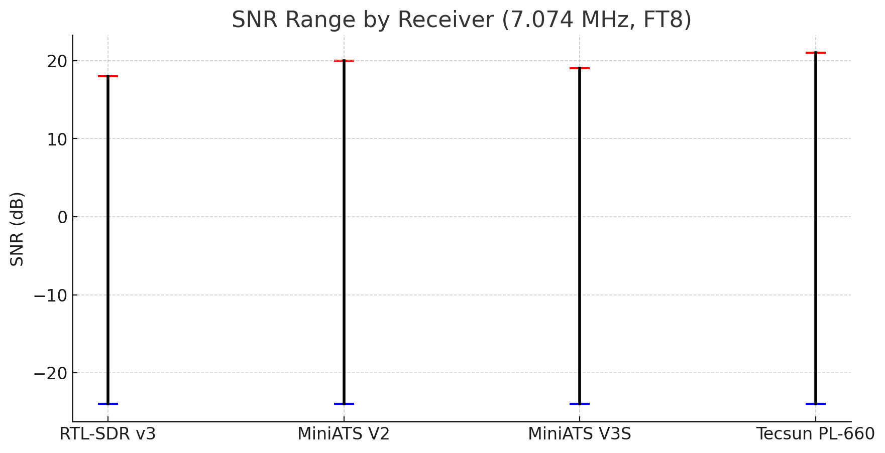
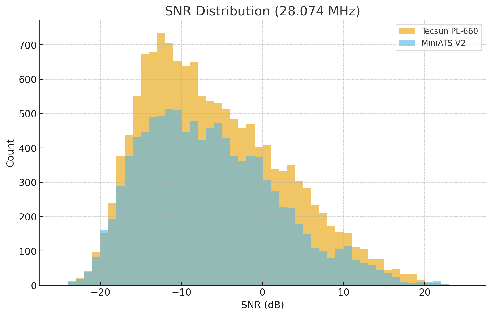
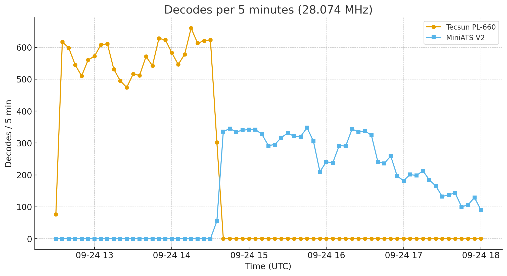
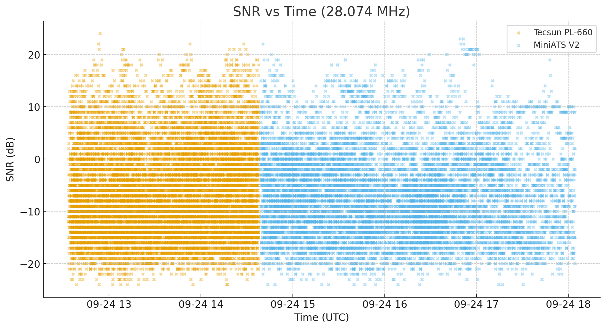
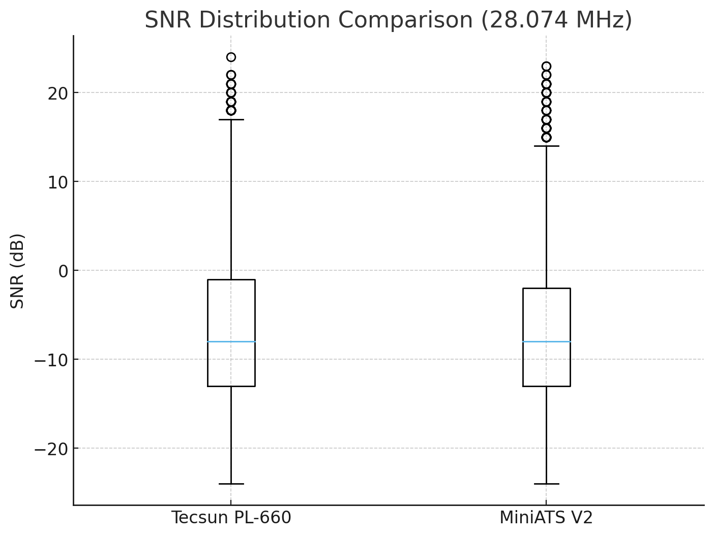

# Receiver Comparison on 40m FT8 (7.074 MHz)

Here I summarize comparative tests between several receivers using the **same antenna system**.  
All experiments were performed in the shack, under the same RF environment (with local noise and interference present).  
The purpose was to evaluate practical FT8 decoding performance between **SDR** and **audio-output radios**.

---

## Antenna & Setup

- **Antenna**: Moonraker X1-HF (RX-only, up to 50 MHz)  
- **Coax**: ~15 m RG58 feedline  
- **Filters**: FM notch filter inline  
- **Ferrites**: 7 turns ferrite choke on pigtail, additional ferrite ~2 m before antenna  
- **Receivers tested**:  
  - RTL-SDR v3 (direct sampling)  
  - MiniATS V2  
  - MiniATS V3S  
  - Tecsun PL-660 (USB SSB mode, Wide filter)

All receivers were placed in the same shack position, using identical feedline and filtering.

---

## Methodology

- Frequency: **7.074 MHz (FT8)**  
- Duration: ~12 hours each run (late afternoon → next morning)  
- Logs collected via **WSJT-X** (`ALL.TXT`)  
- Decodes, SNR statistics, and unique calls/grids were analyzed.  
- Tests were conducted on the same day but sequentially, so propagation changes during the period may affect the comparison.  

---

## Results

### Decodes per Hour

| Receiver        | Decodes/hour (avg) |
|-----------------|---------------------|
| RTL-SDR v3      | ~5000              |
| MiniATS V2      | ~3750              |
| MiniATS V3S     | ~3000              |
| Tecsun PL-660   | ~3145              |

---

### SNR Range

| Receiver        | Min SNR | Max SNR |
|-----------------|---------|---------|
| RTL-SDR v3      | –24 dB  | +18 dB  |
| MiniATS V2      | –24 dB  | +20 dB  |
| MiniATS V3S     | –24 dB  | +19 dB  |
| Tecsun PL-660   | –24 dB  | +21 dB  |

---

## Observations

- **RTL-SDR v3** clearly outperforms the others in sheer number of decodes/hour. IQ sampling at baseband avoids the limitations of narrow audio filters and AGC behavior.  
- **MiniATS V2** shows the best results among the audio-output radios.  
- **MiniATS V3S** is slightly behind the V2 in both decodes/hour and average SNR.  
- **Tecsun PL-660**, despite being a portable analog receiver, matches the MiniATS class closely, and even showed the **highest maximum SNR (+21 dB)** observed in the tests.  

---

## Conclusions

- With identical antenna and feedline, **all audio-output radios (MiniATS, PL-660)** provide roughly similar decoding performance.  
- The **PL-660** holds its ground very well: ~35k decodes overnight, 1311 unique calls, 548 grids, only slightly behind MiniATS.  
- The **RTL-SDR v3** remains the strongest performer due to its ability to feed full IQ data to WSJT-X, offering a wider decode window and higher density of signals.  

📌 **Final takeaway**:  
- For serious monitoring/logging: RTL-SDR v3 is superior.  
- For portable/standalone use: MiniATS and PL-660 deliver excellent results considering their simplicity and form factor.  

---

## Additional Receiver Comparison on 10m FT8 (28.074 MHz): Tecsun PL-660 vs MiniATS V2

This test compared two different receivers connected to the same antenna system:
- **Tecsun PL-660** (audio → sound card → WSJT-X)  
- **MiniATS V2** (audio → sound card → WSJT-X)

### Antenna Setup
- Antenna: **Sirio Boomerang 27A**
- Feedline: 15m RG-58 coax with ferrite choke
- FM notch filter inline
- Both receivers placed at the same location in the shack, subject to the same noise/interference environment

### Receiver Settings
- MiniATS V2: firmware v2.33, Mode SSB, Bandwidth 3 kHz, AGC: On  
- Tecsun PL-660: SSB Wide (~3 kHz, exact value not documented; Narrow is ~2 kHz), Antenna Gain: DX  
- Steinberg UR-22C used as sound card. Input gain and receiver volume were tuned to match ~40 dB on WSJT-X.  
- WSJT-X v2.7.0 for decoding  

### Decoding Performance
| Receiver      | Total Decodes | Duration (min) | Decodes/min | SNR min | SNR max |
|---------------|--------------:|---------------:|------------:|--------:|--------:|
| Tecsun PL-660 | 14,121        | 1,458.6        | **9.68**    | -24     | +24     |
| MiniATS V2    | 10,449        | 1,508.0        | **6.93**    | -24     | +23     |

The Tecsun delivered significantly higher decode rates per minute under the same conditions.

### SNR Distribution
  

- Tecsun: signals across the full SNR range (−24 to +24 dB).  
- MiniATS V2: fewer decodes, concentrated around −10 dB.  

### Decodes Over Time
  

- Tecsun maintained ~500–600 decodes per 5 min.  
- MiniATS V2 consistently lower.  

### SNR vs Time
  

- Tecsun: wide scatter including very weak signals down to −24 dB.  
- MiniATS V2: fewer signals, clustered at moderate SNR.  

### SNR Boxplot
  

- Tecsun: broader distribution, covering both weak and strong signals.  
- MiniATS V2: compressed, missing extremes.  

*Note: Tests were conducted on the same day but sequentially, so propagation changes during the period may affect the comparison.*  
- Tecsun PL-660: 24/09/2025 12:33:30 UTC → 14:37:45 UTC  
- MiniATS V2: 24/09/2025 14:38:45 UTC → 18:04:15 UTC  

### SNR Statistics
| Receiver      | Count  | Mean SNR | Median | Std Dev | Q1  | Q3  | Min | Max |
|---------------|-------:|---------:|-------:|--------:|----:|----:|----:|----:|
| Tecsun PL-660 | 14,121 | -6.42 dB | -6.0   | 8.62    | -13 | 0   | -24 | +24 |
| MiniATS V2    | 10,449 | -6.90 dB | -7.0   | 8.18    | -13 | -1  | -24 | +23 |

### Geographical Analysis
| Receiver      | Unique Grids | Farthest Grid | Distance (km) |
|---------------|-------------:|---------------|--------------:|
| Tecsun PL-660 | 328          | RI16          | 14,473        |
| MiniATS V2    | 258          | PB12          | 14,280        |

The Tecsun not only decoded more signals overall, but also reached more unique locations and slightly farther DX.

### Conclusion
On the 10 m band (28.074 MHz), the **Tecsun PL-660 outperformed the MiniATS V2** in every measured aspect:
- Higher decode rate per minute  
- Broader SNR coverage  
- Wider geographical spread with more unique grids and longer DX  
- More stable performance across time  

While the MiniATS V2 remains usable, it consistently lagged behind the Tecsun in weak-signal reception and throughput under identical test conditions.  

**Overall:** the Tecsun PL-660 demonstrated stronger performance in weak-signal FT8 reception on 28 MHz compared to the MiniATS V2.  

*Note: All tests were conducted with an external, roof-mounted antenna. Performance may vary with telescopic or other antenna types.*  

---

### About Radios
**Tecsun PL-660** – PLL dual-conversion SSB receiver with FM and Airband.  
| Band | Coverage |
|------|----------|
| FM   | 76–108 MHz |
| LW   | 100–519 kHz |
| MW   | 520–1710 kHz |
| SW   | 1711–29999 kHz |
| AIR  | 118–137 MHz |

**MiniATS V2** – compact SDR-style receiver based on SI4732, controlled by ESP32.  
| Band | Coverage |
|------|----------|
| FM   | 64–108 MHz |
| LW   | 153–279 kHz |
| MW   | 520–1710 kHz |
| SW   | 2300–26100 MHz |

---

### Overall Takeaway  
  
Overall, RTL-SDR v3 remains the most powerful option for dense FT8 decoding.  
  
For shack use and digital mode decoding, the RTL-SDR v3 is clearly the first choice.  
  
For field use, voice reception and ease of use, the Tecsun PL-660 stands out: reliable, user-friendly, with a large display, dedicated buttons, and strong, high-quality audio.  
  
For portability, the MiniATS series shines. Despite its small size, it does not lack features - on the contrary, with existing firmwares it can even decode RTTY/CW natively.  
It offers good battery autonomy with a built-in lithium cell, headphone output (V1 is missing headphone amplifier that is present to next versions), and in V3/V3S models, a High-Z antenna input.  
The MiniATS is a tiny yet capable receiver with a color display, ideal for lightweight portable operation.  
