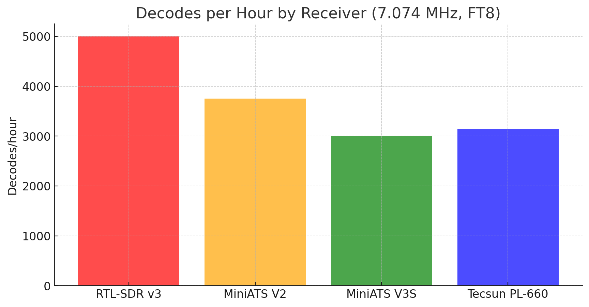

# Receiver Comparison on 40m FT8 (7.074 MHz)

Here I summarize comparative tests between several receivers using the **same antenna system**.  
All experiments were performed in the shack, under the same RF environment (with local noise and interference present).  
The purpose was to evaluate practical FT8 decoding performance between **SDR** and **audio-output radios**.

---

## Antenna & Setup

- **Antenna**: Moonraker X1-HF (RX-only, up to 50 MHz)  
- **Coax**: ~15 m RG58 feedline  
- **Filters**: FM notch filter inline  
- **Ferrites**: 7 turns ferrite choke on pigtail, additional ferrite ~2 m before antenna  
- **Receivers tested**:  
  - RTL-SDR v3 (direct sampling)  
  - MiniATS V2  
  - MiniATS V3S  
  - Tecsun PL-660 (USB SSB mode, Wide filter, audio to soundcard)

All receivers were placed in the same shack position, using identical feedline and filtering.

---

## Methodology

- Frequency: **7.074 MHz (FT8)**  
- Duration: ~12 hours each run (late afternoon → next morning)  
- Logs collected via **WSJT-X** (`ALL.TXT`)  
- Decodes, SNR statistics, and unique calls/grids were analyzed.  
- Tests were performed on different days → **propagation differences must be considered**.  

---

## Results

### Decodes per Hour

| Receiver        | Decodes/hour (avg) |
|-----------------|---------------------|
| RTL-SDR v3      | ~5000              |
| MiniATS V2      | ~3750              |
| MiniATS V3S     | ~3000              |
| Tecsun PL-660   | ~3145              |

---

### SNR Range

| Receiver        | Min SNR | Max SNR |
|-----------------|---------|---------|
| RTL-SDR v3      | –24 dB  | +18 dB  |
| MiniATS V2      | –24 dB  | +20 dB  |
| MiniATS V3S     | –24 dB  | +19 dB  |
| Tecsun PL-660   | –24 dB  | +21 dB  |

---

## Observations

- **RTL-SDR v3** clearly outperforms the others in sheer number of decodes/hour. IQ sampling at baseband avoids the limitations of narrow audio filters and AGC behavior.  
- **MiniATS V2** shows the best results among the audio-output radios.  
- **MiniATS V3S** is slightly behind the V2 in both decodes/hour and average SNR.  
- **Tecsun PL-660**, despite being a portable analog receiver, matches the MiniATS class closely, and even showed the **highest maximum SNR (+21 dB)** observed in the tests.  

---

## Conclusions

- With identical antenna and feedline, **all audio-output radios (MiniATS, PL-660)** provide roughly similar decoding performance.  
- The **PL-660** holds its ground very well: ~35k decodes overnight, 1311 unique calls, 548 grids, only slightly behind MiniATS.  
- The **RTL-SDR v3** remains the strongest performer due to its ability to feed full IQ data to WSJT-X, offering a wider decode window and higher density of signals.  

📌 **Final takeaway**:  
- For serious monitoring/logging: RTL-SDR v3 is superior.  
- For portable/standalone use: MiniATS and PL-660 deliver excellent results considering their simplicity and form factor.  

---
