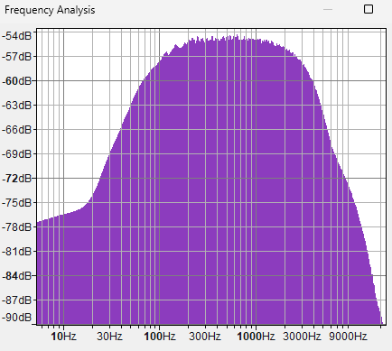
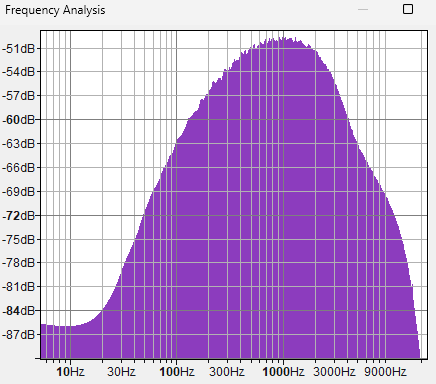
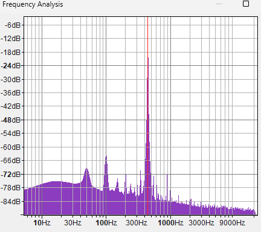
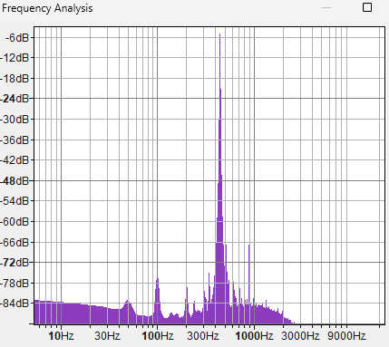
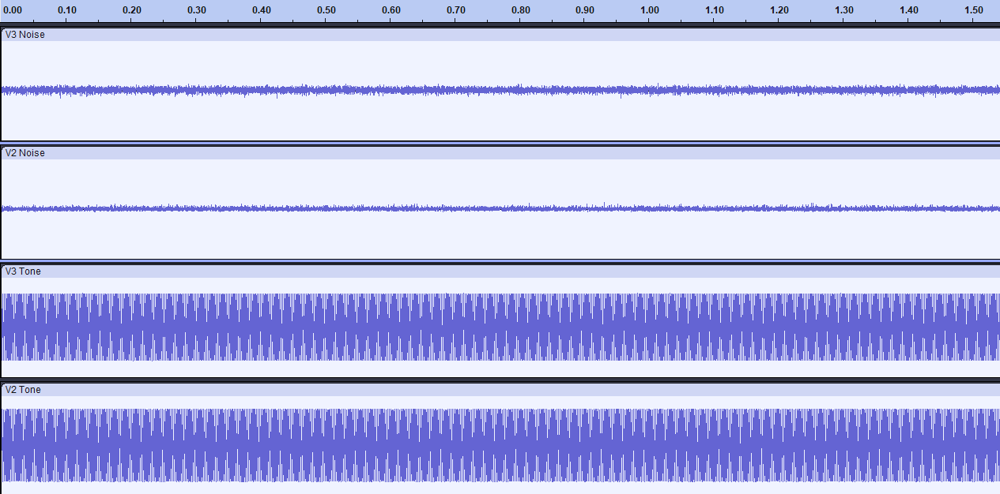
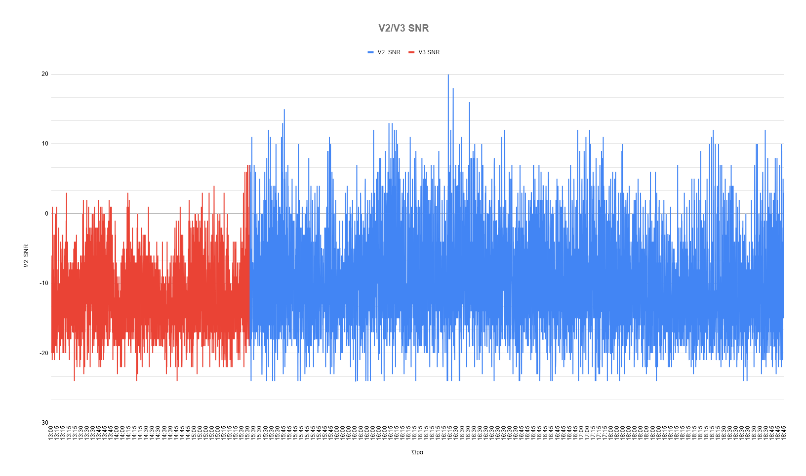
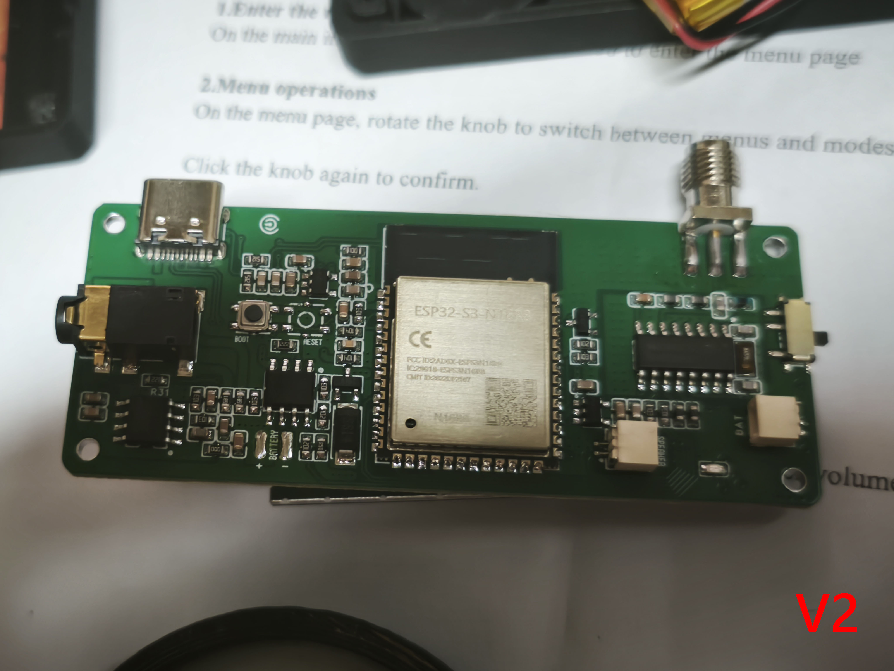
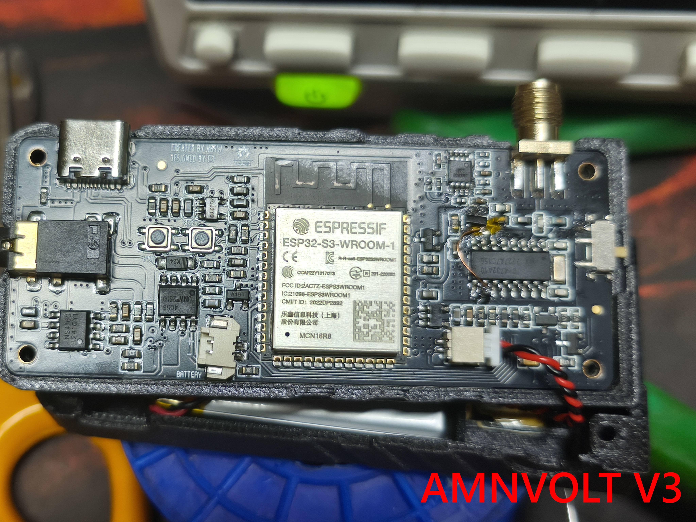

# Mini ATS V2 vs V3 (AMNVOLT) – Audio and SNR Evaluation

## Test Setup

A signal generator (OWON DGE1060) was used to transmit a 440Hz tone at 15000KHz to both Mini ATS receivers (V2 and V3). The output from each receiver was connected to a sound card (Steinberg UR22C), and the input gain was carefully adjusted so that both signals matched in amplitude.

After that, I recorded two sets of audio from each receiver:
1. **Noise Floor** – with no antenna connected at 15000KHz.
2. **Tone Input** – the 440Hz tone from the signal generator at the same frequency.

To eliminate noticeable 50Hz hum on the V2, the signal generator’s ground had to be connected to the line-in ground of the sound card. The V3 didn’t exhibit any hum.

**Note that** I’m not an RF or electronics expert — just a regular guy trying to understand the performance of two receivers in a real-world setup. My goal was not to perform a lab-grade scientific comparison, but a practical evaluation that reflects my actual use case.

---

## Audio Signal Comparison

Measured RMS audio levels:

- **V3 Noise RMS**: -28.27 dB  
- **V2 Noise RMS**: -31.93 dB

V3 appears to have a higher RMS noise level at the output. However, examining the spectrum and waveform data gives deeper insights.

### Frequency Spectra

  
   
  <em>Figure 1: Noise Spectrum of V2</em>

  
   
  <em>Figure 2: Noise Spectrum of V3</em>

  
   
  <em>Figure 3: Spectrum of V2 at 440Hz</em>

  
   
  <em>Figure 4: Spectrum of V3 at 440Hz</em>

From the tone spectra, we observe that the V3 output has less low-frequency ripple and better harmonic suppression around 440Hz.

---

## Audio Waveforms

See the combined waveform view:  

  

This illustrates clearly that the output of V3 has slightly more background noise but a better-defined tone with less visible distortion.

---

## Real-World SNR Performance

A practical comparison was conducted by decoding FT8 signals over time from both receivers.

  
   
  <em>SNR Graph - V2 vs V3</em>

- **Red plot**: V3 (before 15:30)  
- **Blue plot**: V2 (after 15:30)

### Observations

- V2 consistently achieved higher SNR values, including several positive peaks, indicating stronger signal decoding.
- V3 had more negative and lower SNR values overall, showing weaker reception under identical conditions.

The difference in SNR suggests that V2 has a better dynamic range and overall superior signal decoding performance.

---

## Conclusion

Based on both controlled audio measurements and real-world FT8 signal reception:

- **V2 exhibits greater dynamic response to weak and strong FT8 signals**, suggesting higher front-end sensitivity and wider effective SNR range.
- **V3 provides a more stable output**, but with **limited SNR variation**, possibly due to stricter AGC or internal processing smoothing.
- **V2 consistently achieved higher peak SNR** values and deeper minimums, implying a more responsive and sensitive front-end.
- **V3 had a more compressed SNR range**, possibly prioritizing stability over sensitivity.
- In real RF conditions, V2 achieved **consistently higher SNR readings** and **better FT8 decoding success**.
- These results suggest that **V2 has better real-world dynamic range and sensitivity**, despite its simpler or older hardware revision.

### Overall, V2 outperforms V3 both in laboratory noise tests and actual RF decoding scenarios but it suffers from hum noise (50Hz).

---

## Mini ATS V2/V3 PCBs

The tests performed on these two Mini ATS radios (V2 & AMNVOLT V2), using the <a href="https://github.com/esp32-si4732/ats-mini/releases/tag/v2.28">ATS Mini v2.28 firmware</a> version.

  
   
  <em>Mini ATS V2 PCB / Note: This version has the headphone amp on the other side (under the screen) for noise reduction.</em>

  
   
  <em>Mini ATS V3 PCB (AMNVOLT).</em>

