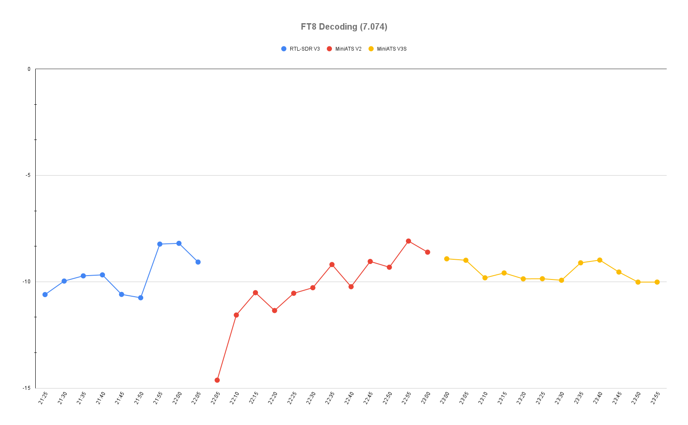
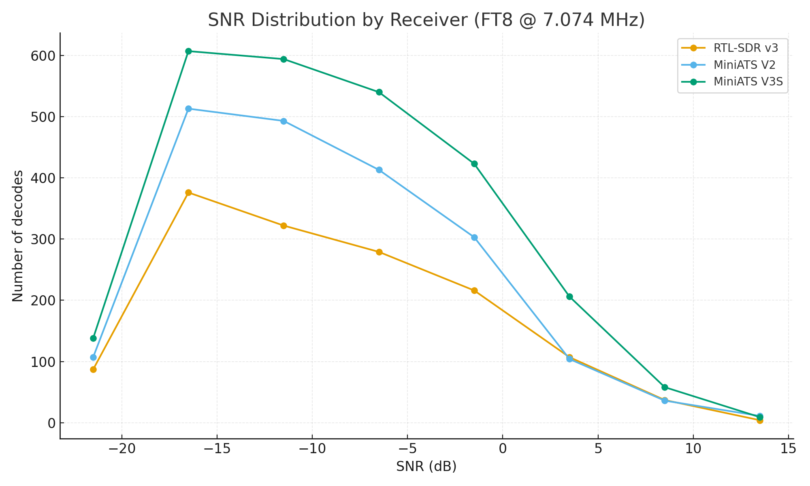

# FT8 Reception Comparison (Moonraker X1-HF @ 7.074 MHz)  
Receivers used: RTL-SDR V3, MiniATS V2, MiniATS V3S  

---

## 1. Decodes Over Time

* The time division is 5 minutes. I average the 5 minute period decodes SNR. Tests are performed same date, just changing the receivers.

---

## 2. Decodes per Minute

| Receiver      | Start              | End                | Duration (min) | Decodes | Decodes/min |
|---------------|-------------------|-------------------|---------------:|--------:|-------------:|
| **RTL-SDR v3** | 2025-09-13 21:27 | 2025-09-13 22:06 | 39.3 | 1429 | **36.4** |
| **MiniATS V2** | 2025-09-13 22:09 | 2025-09-13 23:03 | 53.5 | 1980 | **37.0** |
| **MiniATS V3S**| 2025-09-13 23:05 | 2025-09-14 00:42 | 96.8 | 2575 | **26.6** |

**Conclusion:**  
- RTL-SDR v3 and MiniATS V2 perform almost identically (~36–37 decodes/min).  
- MiniATS V3S lags behind (~26.6/min), about 30% fewer decodes.  
- V2 is the sweet spot with this antenna; RTL-SDR matches closely. V3S is better suited for unmatched antennas (longwire, whips).

---

## 3. SNR Range (Min/Max)

| Receiver      | Min SNR | Max SNR |
|---------------|--------:|--------:|
| **RTL-SDR v3** | –24 dB  | +17 dB  |
| **MiniATS V2** | –24 dB  | +15 dB  |
| **MiniATS V3S**| –24 dB  | +14 dB  |

**Conclusion:**  
All receivers hear signals down to the WSJT-X threshold (–24 dB).  
RTL-SDR v3 captured the strongest peak (+17 dB), with V2 and V3S slightly lower.

---

## 4. SNR Distribution

**Conclusion:**  
- All three receivers decode very weak signals down to –24 dB.  
- RTL-SDR v3 and MiniATS V2 show broader dynamic range, handling both weak and strong signals better.  
- MiniATS V3S is more rounded, with fewer extremes.

---

## 5. SNR by Category

| Receiver      | ≤ –15 dB | –14 to –6 dB | –5 to +5 dB | > +5 dB |
|---------------|---------:|-------------:|------------:|--------:|
| **RTL-SDR v3** | 32.4% | 38.3% | 26.4% | 2.9% |
| **MiniATS V2** | 31.3% | 41.9% | 24.4% | 2.4% |
| **MiniATS V3S**| 28.9% | 40.7% | 27.7% | 2.6% |

**Conclusion:**  
- RTL-SDR v3 is strongest in “very weak” (≤ –15 dB).  
- MiniATS V2 excels in “weak” (–14 to –6 dB).  
- MiniATS V3S emphasizes mid-level signals, with fewer at the extremes.

---

## 6. Final Thoughts
- **RTL-SDR v3**: Best dynamic range, very sensitive to weak signals, and shows strong peaks.  
- **MiniATS V2**: Best balance overall with the Moonraker X1-HF, very close to RTL-SDR performance.  
- **MiniATS V3S**: Trails behind in this test, but could shine with unmatched/whip antennas.

---

## 7. Notes
- **MiniATS V3S** is optimized for used with high impedance antennas, not 50Ω.  
- MiniATS V3S is **modded**, take a look [**here**](../Amnvolt_V3S/JFET_Power_Supply_Mod/).  
- On RTL-SDR v3 the receving was done with SDR# and direct sampling mode. The Mini ATS V2 and V3S were feed via headphones output to a Steinberg UR22C.  
  WSJT-X was used to decode FT8 signals.  
  The bandwidth was 3200Hz on RTL-SDR v3, 3000Hz on MiniATS V2 & V3S.  
- On both MiniATS I had the screen off/AGC 0. Volume around to ~ 40-45, gain on the soundcard tuned to match the same input (about 45 dB on WSJT-X) for every receiver.
- Raw log files are stored [**here**](./logs/).

